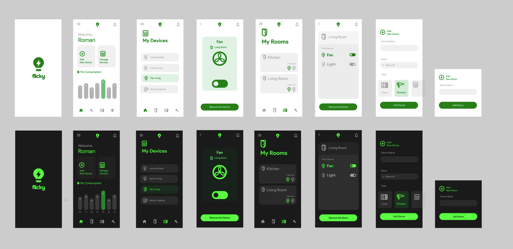
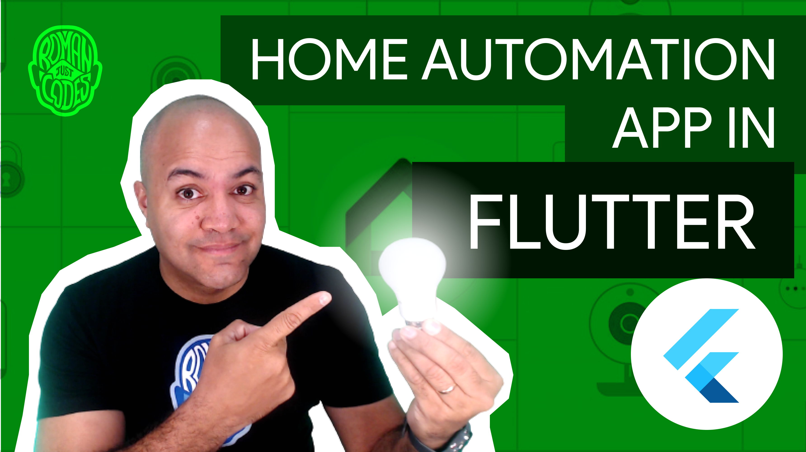

# Home Automation App in Flutter

This is the companion app to the YouTube video Series "Home Automation App in Flutter", a series of videos in which I built a Home Automation System for my home using Flutter by sending commands to connected start plugs and devices installed around the house.

We'll go into the products I picked, their specs, how I set them up, and then we'll go into coding a solution in Flutter that I can deploy to multiple devices around the house so they can serve as hubs for managing the devices I want to control in any given room, like turn them on and off, changing the light intensity, etc.

Check out the videos [here](https://www.youtube.com/playlist?list=PL8NTBhIXP2gH-Z7pgJ6W3wYodZwe7d6bI).

